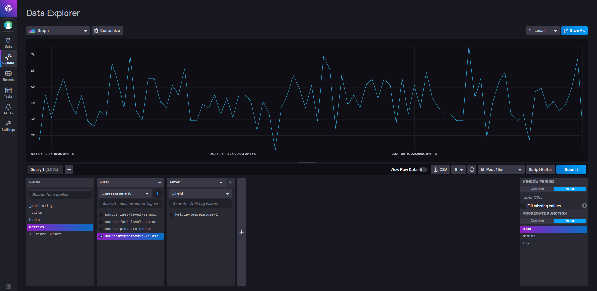
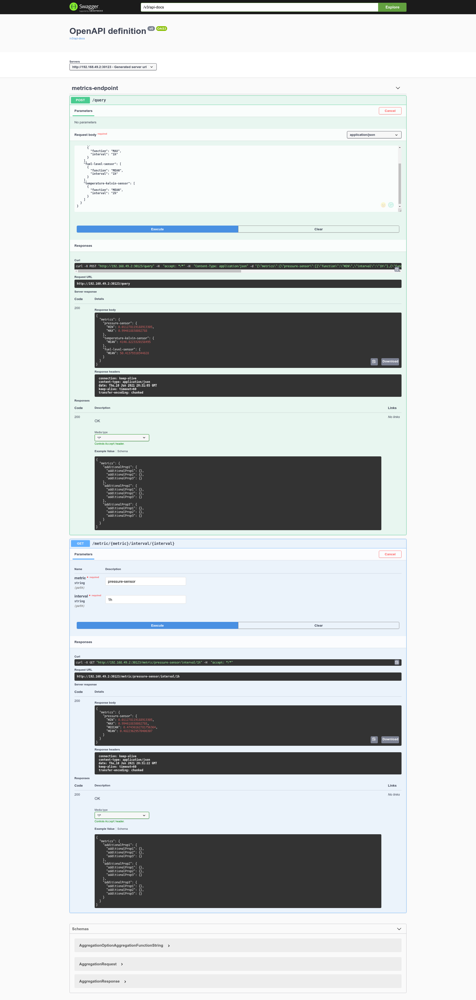

# IoT data processing pipeline

## Motivation

Pipeline to ingest and query data from IoT devices.

## Stack

Project tech stack:

* Java 11
* Spring boot
* Gradle
* JUnit
* Mokito
* Kafka
* InfluxDb
* Docker compose
* Kubernetes
* Kustomize

## Approach

Processing approach is to use small, decoupled applications for metric sources, transformation and sinks,
applications will be interconnected by Kafka queues, as persistence will be used database for metrics - InfluxDB.

Source applications read metrics(in production these may be MQTT interfaces), create `MetricValue` instance
based on read value and configurations, send instance to configured Kafka topic.

Processor application will subscribe to Kafka topic, wait for messages, do transformation, calculate next topic,
send message to topic.

Sink application subscribe to configured topic, read new messages, persist metric value in InfluxDB.

To query database metrics, can be used InfluxDB UI or `access-metrics` application which can extract from DB
aggregated values for single metric or for multiple metrics over REST interface.

## Structure

| Item                        | Description  |
|-----------------------------|--------------|
| core                        | Common code, Kafka access classes, model classes |
| source-fuel-level           | Source application which generate fuel level metrics |
| source-pressure             | Pressure metric source application | 
| source-temp-kelvin          | Temperature source, generate values in Kelvins, produced value is converted to Celsius by `transform-kelvin-to-celsius`  |
| transform-kelvin-to-celsius | Application transform temperature from Kelvin to Celsius |
| sink-db                     | Application which persist metrics to DB |
| access-metrics-query        | Application to query metric aggregations through REST API | 
| dev                         | Directory with utils to start local environment, Kafka, InfluxDB |

Notes:
* sources generate random values
* data exchanged on Kafka queues is in JSON format
* extensibility can be achieved by connecting to topics new metric producers
* horizontal scaling can be done by starting more instances of same application
* scaling of transport layer is well known and documented
* unit tests are based on JUnit 5 and Mockito




## Metrics Query

Query application expose swagger ui for easy access of metrics:

http://localhost:9777/swagger-ui.html

Query single metric:

```

curl -v localhost:9777/metric/pressure-sensor/interval/1h

{
  "min": 0.009788386689890127,
  "median": 0.47214310746901345,
  "max": 0.9972137758382438,
  "mean": 0.4767313862774201
}

```

Aggregation request:

```
curl -X POST "http://localhost:9777/query" -H  "accept: */*" -H  "Content-Type: application/json" -d "{\"metrics\":{\"pressure-sensor\":[{\"function\":\"MIN\",\"interval\":\"1h\"},{\"function\":\"MAX\",\"interval\":\"1h\"}],\"fuel-level-sensor\":[{\"function\":\"MEAN\",\"interval\":\"1h\"}],\"temperature-kelvin-sensor\":[{\"function\":\"MEAN\",\"interval\":\"2h\"}]}}"

Request:
{
  "metrics": {
    "pressure-sensor": [
      {
        "function": "MIN",
        "interval": "1h"
      },
      {
        "function": "MAX",
        "interval": "1h"
      }
    ],
    "fuel-level-sensor": [
      {
        "function": "MEAN",
        "interval": "1h"
      }
    ],
    "temperature-kelvin-sensor": [
      {
        "function": "MEAN",
        "interval": "2h"
      }
    ]
  }
}

Response:

{
  "metrics": {
    "pressure-sensor": {
      "MIN": 0.005507284385931288,
      "MAX": 0.9987821444161251
    },
    "temperature-kelvin-sensor": {
      "MEAN": 4215.17083792702
    },
    "fuel-level-sensor": {
      "MEAN": 50.61309523809524
    }
  }
}
```

## Containers building

Each application has `Dockerfile` which define how application will be packaged in containers.

To build container images in consistent way, should be used script `build_docker.sh` which automatically identify image name and tag.

Example usage:

```
./build_docker.sh <directory name>
```

## Kubernetes deployment

For K8S deployment, in each application is defined `kubernetes` directory, containing deployment resources in `Kustomize` format.

Example usage:

```
kubectl apply -n <namespace> -k transform-kelvin-to-celsius/kubernetes
```

Notes:
* Kafka is expected to be configured outside of application resources
* K8S resources expect running InfluxDB


## Future work

Future improvements of solutions:

* Add integration tests for verifying InfluxDB persistence, Kafka integration

* Avoid 'loop' in messages processing by adding `age` field which will be incremented on each
  operation, messages with high `age` value should be dropped;

* Since solution is a distribuited application - should be introduced a way to do tracing of generated metrics, centralized logs collector;

* Switch to use more advanced Helm charts instead of Kustomize yaml files;

* Add integration with Prometheus monitoring to get insights about state of each application;

* Add liveness and readiness probes for deployed applications;


# License

Only for reference, distribution and/or commercial usage not allowed
